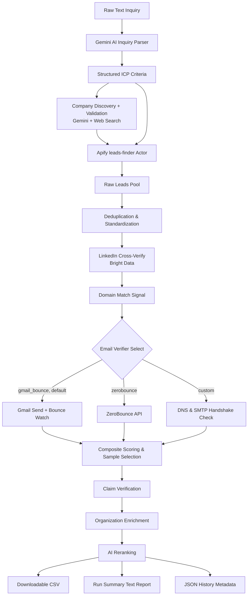

# LeadFlow: B2B Lead Generation & Email Verification Platform
## Comprehensive Product Overview & Specification

This document provides a comprehensive overview of the LeadFlow platform, detailing the business strategy, operational mechanics, system architecture, and technical roadmap. It is designed to serve as a shared blueprint for both business stakeholders and engineering teams.

---

## 1. Business Context

### A. The Business Problem We Solve
In B2B customer acquisition, outbound email prospecting remains one of the most cost-effective channels. However, sales and marketing teams face two major bottlenecks:
1. **Data Decay and Bounce Rates**: Public directories (like Apollo, LinkedIn, etc.) suffer from high rates of outdated information. Sending campaigns to invalid or inactive email addresses ruins domain reputation, landing sales messages directly in spam folders.
2. **High Friction and Search Complexity**: Building target lead lists typically requires sales representatives to master complex filtering panels, write customized boolean search strings, and manually compile sheets across multiple disparate tools.

**LeadFlow** solves the **quality-at-scale** problem. It takes a raw, unstructured business inquiry (e.g., *"I need VP-level operations contacts at logistics startups in Germany with 50-200 people"*) and automatically extracts criteria, scrapes multiple directories, filters out duplicates, verifies email delivery statuses, and returns a pristine, campaign-ready lead list.

### B. Target Customers
* **B2B SaaS Companies**: Enterprise or mid-market growth teams looking to scale their outbound pipelines.
* **Lead Generation and Growth Agencies**: Specialized agencies managing prospecting lists for dozens of concurrent client campaigns.
* **Startup Founders**: Early-stage builders seeking immediate, high-fidelity customer discovery channels without hiring dedicated sales operations personnel.
* **BDR/SDR Teams**: Individual Business Development Representatives seeking to bypass manual database parsing and focus on outreach.

### C. Business Model
LeadFlow operates on a **Credits-Based SaaS Model**:
* **Subscription Tiers**: Users subscribe to a monthly seat-based tier (e.g., Starter, Growth, Enterprise). Each tier comes with a monthly allocation of lead credits.
* **Credit Consumption**: One credit is consumed only when a lead is successfully verified and exported in the final sample list. Low-confidence, invalid, or duplicates cost zero credits.
* **API Pass-Through Options**: High-volume enterprise customers can connect their own API accounts (Apollo.io, Apify, Explorium, ZeroBounce) to bypass default platform credit quotas.

---

## 2. The User Journey

The operational flow of a user interacting with the platform is optimized for simplicity, transparency, and actionable deliverables:

```
┌─────────────────┐      ┌──────────────────┐      ┌───────────────────┐      ┌──────────────────┐
│  1. Input Raw   │ ───> │  2. Monitor Run  │ ───> │ 3. Review Quality │ ───> │  4. Download CSV │
│  Inquiry Text   │      │   & Live Logs    │      │  Stats & Lead ICP │      │  & Launch Outbox │
└─────────────────┘      └──────────────────┘      └───────────────────┘      └──────────────────┘
```

1. **Step 1: Input and Parameters Definition**
   * The user enters a natural-language description of their target audience into the central console.
   * They specify search constraints, such as target quantity (e.g., 25, 50, 100 leads) and maximum pages to inspect.
   * They select their preferred data sources (Apollo.io, Apify, Explorium) and choose the verification level (ZeroBounce API vs. Free SMTP/DNS check).
   * Alternatively, if they have an existing unverified list, they drag and drop a raw JSON/CSV file for verification-only cleaning.

2. **Step 2: Real-Time Execution Tracking**
   * Upon submission, the platform triggers the background pipeline.
   * The dashboard transitions to a progress view, displaying active stages, current page numbers, and real-time logs streamed via Server-Sent Events (SSE).
   * Counters update continuously, showing the total raw leads found, deduplicated count, invalid emails blocked, and high-confidence leads compiled.

3. **Step 3: Quality Control & Analysis Review**
   * Once finished, the interface renders the extracted Ideal Customer Profile (ICP) strategy created by the AI.
   * The user reviews the 7-part strategic analysis (which includes target pain points, tech stack signals, buying behaviors, and negative fit criteria).
   * They can review the compiled list in an interactive table displaying Names, Titles, Companies, Verified Emails, and Source origins.

4. **Step 4: Secure Data Export**
   * The user clicks "Download CSV" to retrieve their clean, verified, and deduplicated prospect list.
   * A companion txt report provides audit verification summaries (bounce rate projections, API source contributions) which can be archived for compliance or sales analytics.

---

## 3. Platform Functionality

LeadFlow bundles several core modules that work synchronously to deliver premium lead list generation:

### A. Natural Language Inquiry Parser (AI Strategy Engine)
* **Goal**: Eliminates search query building friction.
* **How it works**: Uses the Gemini API to parse free-form text. It translates simple sentences into a structured target JSON object and builds a professional target profile.
* **Deliverable**: A comprehensive Ideal Customer Profile (ICP) including core buyer personas, firmographics, pain points, trigger signals, common sales objections, and negative criteria (who to avoid).

### B. Lead Sourcing & Cross-Verification Engine
* **Goal**: Gathers structured lead profiles from a single reliable provider, then cross-checks them against live LinkedIn data.
* **Sourcing**:
  * **Apify API (`code_crafter/leads-finder` actor)**: This pipeline's sole lead-sourcing platform. Runs once per search against the ICP's titles, industries, geography, and company-size filters.
  * **Company-First Discovery (optional)**: Gemini + live web search can identify and validate a candidate company list from the ICP's firmographics first, scoping the Apify search to just those companies instead of an open ICP-wide search.
* **Cross-Verification**:
  * **Bright Data LinkedIn Dataset API**: Confirms each lead's current employer and title against their live LinkedIn profile, catching stale or inaccurate scraped data. Results are cached for 30 days.

### C. Intelligent Data Deduplication & Standardization
* **Goal**: Prevents redundant outreach and saves API credits.
* **How it works**: Normalizes and cleans string values. It applies a two-pass deduplication check:
  * **Direct Match**: Email address deduplication.
  * **Fingerprint Match**: Generates MD5 hash fingerprints based on a normalized combination of full name and company name (catching leads who appear with different emails across sources).

### D. Advanced Email Verification Pipeline
* **Goal**: Minimizes bounces and protects outbound email server domain health.
* **Providers**:
  * **Gmail Bounce Verifier (default)**: Sends a real email from the configured Gmail sender to each lead and watches the inbox for a bounce — the ground-truth check the UI uses.
  * **ZeroBounce API**: Optional paid cloud-based verification, selectable via the API.
  * **Custom SMTP/DNS Verifier**: A free built-in backup that validates email syntax, queries target domain MX records, and initiates SMTP handshakes with mail servers to verify existence without sending emails.
* **Thresholding**: Only emails achieving a **confidence score ≥ 95** pass to the selection phase.

### E. Quality-Tiered Sample Selector
* **Goal**: Returns only the highest quality leads within the user's requested limit.
* **How it works**: Sorts the validated lead pool into three distinct tiers:
  * **Tier 1 (Premium)**: Leads matching exact target titles, containing a validated email address, and matching target keywords.
  * **Tier 2 (Fallback)**: Leads with partial matching criteria.
  * **Tier 3 (General)**: Verified leads within the industry but with slightly varying job titles.
  * It returns the top $N$ leads starting from Tier 1, falling back to lower tiers only if the primary criteria yields insufficient results.

---

## 4. Technical Architecture & Integrations

LeadFlow is built on a modern, asynchronous Python backend coupled with a premium, real-time web dashboard.

### A. Technology Stack
* **Language**: Python 3.11+
* **Framework**: Flask (Web server, API routers, and SSE stream engines)
* **Real-time Communication**: Server-Sent Events (SSE) via Flask streams
* **Frontend**: HTML5, Vanilla CSS3 (Custom design system utilizing glassmorphism, radial color blobs, custom scrollbars, and keyframe animations), JavaScript ES6 (asynchronous fetch calls and DOM updates)
* **Libraries**: `google-genai` (Gemini SDK), `requests` (API requests), `dns.resolver` (DNS checks), `dotenv` (environment configuration)

### B. Third-Party Integrations
The platform leverages specialized APIs to power each stage of the pipeline:

| API Service | Integration Layer | Role in Platform |
| :--- | :--- | :--- |
| **Gemini API** | `google.genai.Client` | Translates raw text inquiries into structured ICPs; discovers/validates candidate companies via web search; verifies company claims; reranks the final sample; provides strategic business assumptions. |
| **Apify API** | `code_crafter/leads-finder` actor | This pipeline's sole lead-sourcing platform — pulls structured lead profiles matching the ICP's titles, industries, geography, and company size. |
| **Bright Data Dataset API** | LinkedIn profile scrape | Cross-verifies each lead's current employer/title against their live LinkedIn profile (cached 30 days). |
| **Gmail SMTP/IMAP** | `verify_emails_via_gmail_bounce()` | Default email verifier — sends a real email and watches the inbox for a bounce to confirm deliverability. |
| **ZeroBounce API** | Batch Email Validation API | Optional paid verifier (`provider=zerobounce`); validates deliverability and flags bad domains or catch-alls. |

### C. Data Flow Pipeline
The diagram below illustrates how an inquiry moves through the system, transitioning from raw text to a verified lead list:



---

## 5. Product Lifecycle & Roadmap

### A. Conception & Evolution
LeadFlow was conceived to solve the manual overhead associated with launching outbound sales experiments. 
1. **Milestone 1: Proof of Concept (CLI-based)**
   * Built the core sequential pipeline in Python, querying Apollo and verifying emails via DNS.
2. **Milestone 2: Multi-Source Enrichment**
   * Added Apify web scraping capabilities, Google Organic result parsing with Gemini, and (since retired) Apollo and Explorium API integrations.
3. **Milestone 3: Real-Time Web Dashboard**
   * Implemented the Flask server, created a multi-threaded queue handler, and built the Server-Sent Events (SSE) log console.
4. **Milestone 4: Premium UI Redesign**
   * Transformed the dashboard with a dark space theme, adding moving background orbs, responsive layouts, SVG badges, and a custom API health diagnosis check.
5. **Milestone 5: Pipeline Consolidation & Quality Pass (Current State)**
   * Retired the Apollo and Explorium data sources in favor of Apify as the sole lead-sourcing platform, backed by a Bright Data LinkedIn cross-verification stage, quality gates, composite scoring, claim verification, organization enrichment, and AI reranking — a 13-stage pipeline. Split the former monolithic `app.py`/`pipeline.py` into `app/` Blueprints and a `pipeline/` package. Replaced the dark space theme with a light-first, Stripe/Attio-style visual language.

### B. Current Status
* **Version**: 1.3.0
* **Deployment**: Local developer environment. Fully functional Flask server capable of performing end-to-end pipelines, monitoring real-time API latency, and displaying run histories.
* **Database**: In-memory dictionary state storage for run queues, backed by flat-file storage (`./output/` JSON/CSV) for persistent history records.

### C. Future Roadmap
* **Phase 1: Multi-Tenant Cloud Deployment**
   * Migrate the local run store to PostgreSQL and deploy the application via Docker containers.
   * Integrate authentication (OAuth/JWT) to manage user accounts.
* **Phase 2: Automated Campaign Sequencing**
   * Build native webhooks or direct integrations with email dispatchers (e.g., Instantly.ai, Lemlist) to automatically push verified leads straight into active outbound sequences.
* **Phase 3: Deep Contact Enrichment**
   * Integrate AI-driven personalization (Gemini analyzing target company websites to generate customized intro sentences for each lead).
* **Phase 4: Cron-Scheduled Continuous Prospecting**
   * Enable users to set up "always-on" recurring queries that find and verify new leads on a weekly basis, sending Slack/email alerts when new batches are ready.

---

## 6. Strategic Value Proposition

What sets LeadFlow apart from traditional B2B lead platforms?

* **Elimination of Boolean Query Fatigue**: Users do not need to understand complex database queries. Natural language parsing handles the translation, allowing business leaders or founders to spin up prospect campaigns in minutes.
* **Unified Multi-Source Sourcing**: Standard databases often have gaps. LeadFlow combines database records (Apollo) with live web indexing (Apify) and enrichment databases (Explorium) to construct a comprehensive target list.
* **Protecting Outreach Reputation**: Outbound campaigns fail when domains get blacklisted due to bounced emails. LeadFlow's double-pass verification system (filtering on a confidence score of 95+) ensures lists are clean before they reach outbound mailboxes.
* **High Transparency**: Unlike closed-source data brokers, LeadFlow provides a live terminal console showing exactly where each lead came from, what DNS checks were run, and how the scores were calculated.

---
*Created by the LeadFlow Product Team. Last updated: July 2026.*
